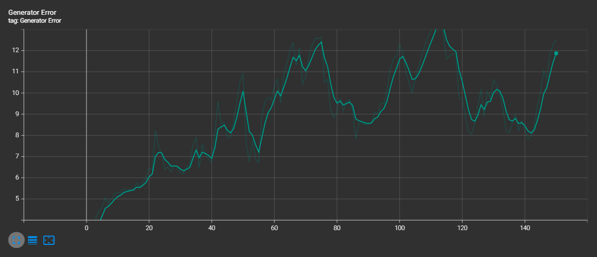
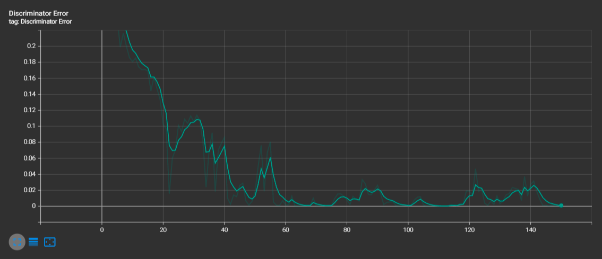

# stock-prediction

This repository is trying to generate estimates of future stock value.
Yes, I know it is impossible to get accurate future values of the stock market. If you use this, I am not liable for any losses of money. 
I used this to learn about different types of models and in which conditions they perform well, as you can see below in the training journal.

## Front-end
You can find a front-end user interface at this github repo: https://github.com/SgtMilk/stock-prediction-frontend 

## Setup

This project is set up to use VS Code devcontainers. If you do not wish to use them, the following section tells you how to to install required packages.

## Required packages

All required packages are specified in `./requirements.txt`.
To install them, run `pip3 install -r requirements.txt`

## Running the project

To run the backend services, run `python3 app.py`

## Training the model

The model is currently a work-in-progress. To train it, run `python3 train.py`.
You can play with hyperparameters in `./src/hyperparameters/gan.py`.

NOTE: You will have to download stock data the first time. You can change the `no_download` paramenter in `./src/hyperparameters/gan.py` to be `False` for that first run.

The model-training code is all in the `./src` folder.
If a helper function has to do with data or cleaning that data, it is situated in the `./src/data` folder.
If a helper function has anything to do with the pytorch model, it is situated in the `./src/model` folder.

To use Tensorboard alonside your training, run `tensorboard --logdir=runs` to run a tensorboard server.

## Note to the user

The backend services included in this repo are not scalable and were not designed to be so. I would strongly advise to write your own backend services if you want to use this in a large-scale system (the database is a json file 🙂️)

## Training Journal
All following trainings were done over 150 epochs.
 
### Training (1) results (GeneratorV1 with `pred_length = 30`)
Training time: 3h25m23s  
MSE: 23702.3984375

This training method gave an output of 30 from the generator, but inside, it's calling itself 30 times and predicting from data it predicted previously and real data. This generator unfortunately suffered from exploding gradients, as we can see in the output example.

### Training (2) results (GeneratorV1 with `pred_length = 1`)
Training time: 43m28s  
MSE: 71499.296875

This training method is similar to the previous one, but it is only predicting one number in the generator while training, but calls itself in a loop when serving predictions in eval mode. Unfortunately, this training method also suffered from exploding gradients.

### Training (3) results (GeneratorV2)
Training time: TODO (forgot to write it down)
MSE: TODO (forgot to write it down)

I used another, more traditional convolutional and GRU GAN network for this, and it seemed to train well. It actually showed the underlying flaw of using GANs for stock price generation. All the outputs looked similar and did not seem to indicate where the stock was going and seemed almost unresponsive to the input. This is what I get I guess for trying to input actual data instead of noise in the GAN 🙂️.

### Training (4) results (GeneratorV3) -- iteration2 branch
Training time: 54m18s  
MSE: 0.5389038920402527

I updated the previous training (classic convolutional gan) to be a modified cgan. Instead of being divided in classes like a normal cgan, I just inputted the raw past stock prices. It seemed to do exactly what a cgan does: outputs seemed to be similar in some contexts. For example, two ETFs following the S&P 500 were extremely similar, just like the GAN above. Unfortunately, I don't think it would accurately predict real outputs because it grouped some stocks in the same category such as `CL=F` and `AAPL`. Maybe a good idea would be to quantize stock ouput labels so that they would fit better in set categories.

### Training (5) results (RNN GAN)
Training time: 10m56s  
MSE per stock lifetime: 323.52637683953446

I properly learned about different types of RNNs recently, so I decided to implement a GAN RNN. The results seemed a lot better than previous models, but the results seemed a bit too deterministic. I did not put any noise, because I wanted the output to be deterministic, but all output progressed in a similar fashion, which is unwanted. Even by adding some noise to make it more like a traditional GAN, I don't think it is having the behavior that I want for stock prediction. I will have to remove the adversarial training in future iterations, but it was a good learning experience.

Attached research: https://arxiv.org/pdf/1611.09904.pdf

### Training (6) results (RNN C-GAN) -- iteration3 branch
Training time: 42m35s  
MSE per stock lifetime: 318.65036752531785  

I added some noise to the input to add variability, just by curiosity. The same GAN problem persisted.

### Training (7) results (RNN) -- main branch
Training time: 1h26m6s
MSE per stock lifetime: 22191.953253799486

I made the dataset five times bigger and dropped the adversarial training. I think I am seeing some better results. The MSE is higher, but I think that is caused by the bigger dataset.

## Copyright

Copyright (c) 2022 Alix Routhier-Lalonde. Licence included in root of package.
