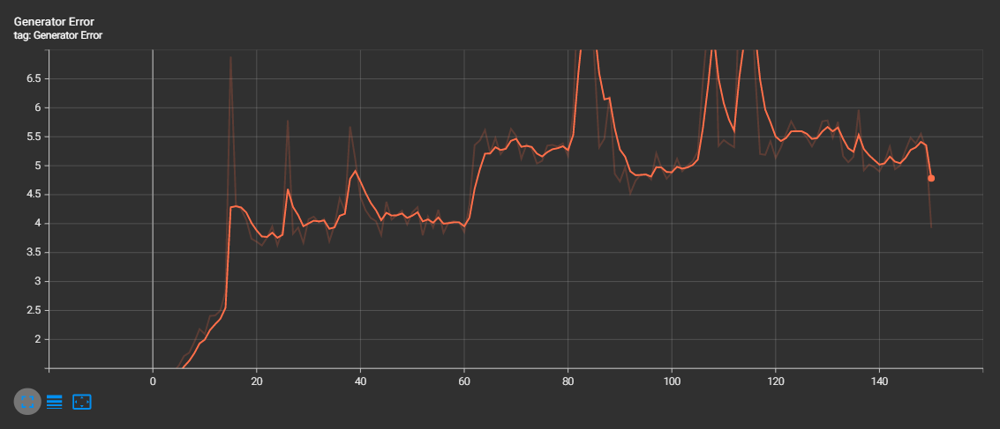

# stock-prediction

This repository is trying to generate estimates of future stock value.
Yes, I know it is impossible to get accurate future values of the stock market. If you use this, I am not liable for any losses of money. 
The prediction uses a PyTorch convolution/GRU GAN model.

## Front-end
You can find a front-end user interface at this github repo: https://github.com/SgtMilk/stock-prediction-frontend 

## Setup

This project is set up to use VS Code devcontainers. If you do not wish to use them, the following section tells you how to to install required packages.

## Required packages

All required packages are specified in `./requirements.txt`.
To install them, run `pip3 install -r requirements.txt`

## Running the project

To run the backend services, run `python3 app.py`

## Training the model

The model is currently a work-in-progress. To train it, run `python3 train.py`.
You can play with hyperparameters in `./src/hyperparameters/gan.py`.

NOTE: You will have to download stock data the first time. You can change the `no_download` paramenter in `./src/hyperparameters/gan.py` to be `False` for that first run.

The model-training code is all in the `./src` folder.
If a helper function has to do with data or cleaning that data, it is situated in the `./src/data` folder.
If a helper function has anything to do with the pytorch model, it is situated in the `./src/model` folder.

To use Tensorboard alonside your training, run `tensorboard --logdir=runs` to run a tensorboard server.

## Note to the user

The backend services included in this repo are not scalable and were not designed to be so. I would strongly advise to write your own backend services if you want to use this in a large-scale system (the database is a json file 🙂️)

## Training Analysis
I trained it in 2 modes: 
- (1) Trained to only predict one day and then from the predicted data predict the next day and on and on.
- (2) Did the same thing as in (1) but the for-loop prediction is on the training. This is done so that the error is calculated on multiple days.

To change training mode, change the `pred_length` parameter in the `./src/hyperparameters/ gan.py` to 1 (or 30).
 
### Training (1) results
Training time: 15m6s  
MSE: 0.0023658988066017628

(Actual data)

(Generated data)

### Training (2) results
Training time: 1h44m17s  
MSE: 0.016118979081511497

(Actual data)

(Generated data)

### Training (3) results

I used another, more traditional convolutional and GRU GAN network for this, and it seemed to train well. It actually showed the underlying flaw of using GANs for stock price generation. All the outputs looked similar and did not seem to indicate where the stock was going and seemed almost unresponsive to the input. This is what I get I guess for trying to input actual data instead of noise in the GAN 🙂️.

### Analysis
Even if the first training method seems better because of a lower error, that lower error could maybe be only from not having to predict over and over, is not representative of its real-world usage.  

The first training method seems to have a high discriminator error, which can be seen as a good sign in this case: the discriminator is unable to distinguish the generated data from the actual data. Again, this might just be because it only has one thing to predict.

Both training methods could be used here: the first method statistically gives better results, but the second method is more representative of real-world usage, so it might give better predictions.

## Copyright

Copyright (c) 2022 Alix Routhier-Lalonde. Licence included in root of package.
